# Prompt Insights: Architecture & Core Principles

This document provides a comprehensive, Confluence-style overview of the Prompt Insights machine learning pipeline. The core objective of this project is to accurately categorize 1.2 million historical user prompts into 236 highly specific, industry-standard subcategories **without relying on expensive, third-party Deep Learning APIs (like OpenAI or Claude).**

To achieve our strict 99% accuracy target on ultra-low-resource hardware (1 CPU core, <3GB RAM), the architecture utilizes a multi-phase cascade of heavily optimized Scikit-Learn algorithms, custom Unicode heuristic filters, and a self-healing Machine Learning keyword enrichment loop.

## High-Level Architecture Flow

```mermaid
%% Cache Buster: v2 - Forces GitHub to re-render the absolute AIObservatory URLs
graph TD
    %% Styling Definitions
    classDef file fill:#f9f2f4,stroke:#c7254e,stroke-width:2px,color:#c7254e;
    classDef script fill:#dff0d8,stroke:#3c763d,stroke-width:2px,color:#3c763d;
    classDef ml fill:#d9edf7,stroke:#31708f,stroke-width:2px,color:#31708f;
    classDef db fill:#fcf8e3,stroke:#8a6d3b,stroke-width:2px,color:#8a6d3b;
    classDef filter fill:#f5f5f5,stroke:#333,stroke-width:1px,stroke-dasharray: 5 5;

    %% Nodes
    RAW[Raw Daily Prompts<br/>cleaned_prompts_YYYY-MM-DD.txt]:::file
    TAX[optimized_taxonomy.csv]:::file
    
    subgraph phase1 [Phase 1: Language Filtering]
        LANG[language_router.py]:::script
        UNI{Unicode > 15%?}:::filter
        DET{langdetect == 'en'?}:::filter
        RES{<150 chars + TECH_WORDS?}:::filter
    end

    subgraph phase2 [Phase 2: Zero-Shot Mathematical Routing]
        DISC[discovery.py]:::script
        TFIDF[TF-IDF Vectorization<br/>Word + Char N-Grams]:::ml
        COS[Cosine Similarity Score]:::ml
        MASK{Strict Overlap Mask<br/>>= 2 Keywords Match?}:::filter
    end

    subgraph phase3 [Phase 3: ML Rescue Sweep]
        SGD[SGD Classifier<br/>ElasticNet Penalty]:::ml
        PRED[Predict Outliers based on<br/>Hidden Word Correlations]:::ml
    end
    
    subgraph phase4 [Phase 4: Data Export & Storage]
        EXPORT[export_to_db.py]:::script
        PANDAS[Pandas Aggregation<br/>Group By Category]:::ml
        PG[(Postgres Database<br/>prompt_insights Table)]:::db
    end
    
    subgraph enrich_loop [Keyword Enrichment Loop - Run Periodically]
        ENRICH[enrich_keywords.py]:::script
        WEIGHTS[Extract Top 15<br/>SGD Mathematical Weights]:::ml
        DEDUPE[dedupe_keywords.py]:::script
    end

    %% Flow Execution
    RAW --> LANG
    LANG --> UNI
    UNI -- Yes --> DROP1((Drop: Foreign Language))
    UNI -- No --> DET
    DET -- Yes --> DISC
    DET -- No --> RES
    RES -- Yes --> DISC
    RES -- No --> DROP2((Drop: Foreign Language))

    DISC --> |Reads Keywords| TAX
    DISC --> TFIDF
    TFIDF --> COS
    COS --> MASK
    
    MASK -- Passed --> GROUND[Officially Categorized<br/>Ground Truth Dataset]:::file
    MASK -- Failed --> OUTLIERS[Outliers<br/>Other/Misc]:::file
    
    GROUND --> |Trains Model| SGD
    OUTLIERS --> |Feeds into| PRED
    SGD --> PRED
    
    PRED -- Rescued --> GROUND
    PRED -- Unrescued --> GARBAGE((Drop: Garbage))
    
    GROUND --> |Outputs| FINAL[fully_categorized_dataset.csv]:::file
    
    FINAL --> EXPORT
    EXPORT --> PANDAS
    PANDAS --> PG
    
    FINAL -.-> |If updating taxonomy| ENRICH
    ENRICH -.-> WEIGHTS
    WEIGHTS -.-> DEDUPE
    DEDUPE -.-> |Overwrites| TAX

    %% Clickable Links to Documentation Anchors below
    click LANG "https://github.com/krishna-mk-0124/Prompt_Insights/blob/master/AIObservatory/ARCHITECTURE.md#phase-1-data-ingestion--language-filtering" "View Details & Examples"
    click UNI "https://github.com/krishna-mk-0124/Prompt_Insights/blob/master/AIObservatory/ARCHITECTURE.md#phase-1-data-ingestion--language-filtering" "View Details & Examples"
    click DET "https://github.com/krishna-mk-0124/Prompt_Insights/blob/master/AIObservatory/ARCHITECTURE.md#phase-1-data-ingestion--language-filtering" "View Details & Examples"
    click RES "https://github.com/krishna-mk-0124/Prompt_Insights/blob/master/AIObservatory/ARCHITECTURE.md#phase-1-data-ingestion--language-filtering" "View Details & Examples"
    
    click DISC "https://github.com/krishna-mk-0124/Prompt_Insights/blob/master/AIObservatory/ARCHITECTURE.md#phase-2-the-zero-shot-router-cosine-similarity" "View Details & Examples"
    click TFIDF "https://github.com/krishna-mk-0124/Prompt_Insights/blob/master/AIObservatory/ARCHITECTURE.md#phase-2-the-zero-shot-router-cosine-similarity" "View Details & Examples"
    click COS "https://github.com/krishna-mk-0124/Prompt_Insights/blob/master/AIObservatory/ARCHITECTURE.md#phase-2-the-zero-shot-router-cosine-similarity" "View Details & Examples"
    click MASK "https://github.com/krishna-mk-0124/Prompt_Insights/blob/master/AIObservatory/ARCHITECTURE.md#phase-2-the-zero-shot-router-cosine-similarity" "View Details & Examples"

    click SGD "https://github.com/krishna-mk-0124/Prompt_Insights/blob/master/AIObservatory/ARCHITECTURE.md#phase-3-the-ml-rescue-sweep" "View Details & Examples"
    click PRED "https://github.com/krishna-mk-0124/Prompt_Insights/blob/master/AIObservatory/ARCHITECTURE.md#phase-3-the-ml-rescue-sweep" "View Details & Examples"
    
    click EXPORT "https://github.com/krishna-mk-0124/Prompt_Insights/blob/master/AIObservatory/ARCHITECTURE.md#phase-4-data-export--storage" "View Details & Examples"
    click PANDAS "https://github.com/krishna-mk-0124/Prompt_Insights/blob/master/AIObservatory/ARCHITECTURE.md#phase-4-data-export--storage" "View Details & Examples"
    click PG "https://github.com/krishna-mk-0124/Prompt_Insights/blob/master/AIObservatory/ARCHITECTURE.md#phase-4-data-export--storage" "View Details & Examples"
    
    click ENRICH "https://github.com/krishna-mk-0124/Prompt_Insights/blob/master/AIObservatory/ARCHITECTURE.md#phase-5-the-keyword-enrichment-loop" "View Details & Examples"
    click WEIGHTS "https://github.com/krishna-mk-0124/Prompt_Insights/blob/master/AIObservatory/ARCHITECTURE.md#phase-5-the-keyword-enrichment-loop" "View Details & Examples"
    click DEDUPE "https://github.com/krishna-mk-0124/Prompt_Insights/blob/master/AIObservatory/ARCHITECTURE.md#phase-5-the-keyword-enrichment-loop" "View Details & Examples"
```



---

## Phase 1: Data Ingestion & Language Filtering

**Script:** `src/language_router.py`

Before mathematical categorization begins, the pipeline must strip out non-English prompts, as the taxonomy is designed for English jargon. 

### Mechanisms & Algorithms:
1.  **Fast Unicode Filter Heuristic:** 
    Running full language detection on 1.2 million rows is extremely slow. We bypass this by first calculating the ratio of non-ASCII characters (`ord(c) > 127`). If a prompt has >5 Unicode characters and the ratio exceeds 15%, it is overwhelmingly likely to be Chinese, Japanese, Korean, Arabic, or Russian. It is instantly routed out of the pipeline.
2.  **LRU Cached `langdetect`:**
    For the remaining prompts, we use the `langdetect` library. Because employee prompts often contain exact duplicates (e.g., "how to reset password"), we wrap the detector in an `@lru_cache(maxsize=100000)` to achieve an massive speedup by never recalculating the same string twice.
3.  **The Tech Rescue Override (Threshold <150 chars):**
    `langdetect` notoriously misclassifies short English code snippets (e.g., `select * from users`) as foreign languages like Italian or Romanian because they lack standard English grammar. If a prompt is under 150 characters, we cross-reference it against a hardcoded set of `TECH_WORDS` (`sql`, `query`, `error`, `python`). If a match is found, we forcefully override the algorithm and route it back into the English pipeline.

**Example:**
*   **Prompt:** `select * from server_logs`
*   **Action:** `langdetect` guesses Italian. The Tech Rescue override sees the word "server" and length <150, overriding it to `en`.

---

## Phase 2: The Zero-Shot Router (Cosine Similarity)

**Script:** `src/discovery.py`

This is the primary categorization engine. It attempts to map the English prompts to the 236 subcategories defined in `optimized_taxonomy.csv`.

### Mechanisms & Algorithms:
1.  **Dual TF-IDF Vectorization:**
    Instead of deep learning embeddings, we convert the prompts into massive mathematical sparse matrices using `TfidfVectorizer`. We run two in parallel:
    *   **Word N-Grams:** Looks at 1-word to 2-word combinations. (e.g., `"docker container"`). `max_features=50000`.
    *   **Character N-Grams (`analyzer='char_wb'`):** Looks at 3 to 5 letter chunks. This makes the algorithm virtually immune to typos. `max_features=40000`.
2.  **Cosine Similarity:**
    We vectorize both the Prompts and the Taxonomy Keywords, and calculate the Cosine Similarity dot-product. The prompt is assigned to the category with the highest mathematical score.
3.  **The Strict Overlap Mask (The Quality Gate):**
    A high cosine similarity score alone is dangerous (e.g., if a prompt is only 2 words long, a single matching word yields a falsely high 50% score). We use a `CountVectorizer` as an "Overlap Mask". A prompt is ONLY allowed to pass Phase 2 if it physically shares **at least 2 overlapping words** with the taxonomy category.

**Example:**
*   **Prompt:** `"I need to build a dockerized app for my sql database"`
*   **Action:** Phase 2 calculates the Word/Char TF-IDF score. The highest similarity is the "Databases" category. The Overlap Mask verifies that the prompt contains `sql` and `database` (2 words), which match the taxonomy. The prompt is officially categorized.

---

## Phase 3: The ML Rescue Sweep

**Script:** `src/discovery.py`

Prompts that fail the Strict Overlap Mask in Phase 2 are dumped into an "Other/Miscellaneous" bucket. Phase 3 acts as a supervised Machine Learning safety net to rescue these outliers.

### Mechanisms & Algorithms:
1.  **Dynamic Training Data:**
    The prompts that *successfully* passed Phase 2 are used as the "Ground Truth" training data.
2.  **SGD Classifier with ElasticNet Regularization:**
    We train a Logistic Regression model via Stochastic Gradient Descent (`SGDClassifier`). 
    *   **Penalty:** We use `penalty='elasticnet'` with `l1_ratio=0.15`. This is critical. ElasticNet mathematically shrinks the weights of "noise" words (like 'the', 'and', 'please') to exactly `0.0`, ensuring the model only pays attention to dense technical jargon.
    *   **One-vs-Rest:** Because there are 236 categories, the algorithm actually trains 236 separate binary models in C/Cython.
3.  **The Rescue Prediction:**
    Once trained on the Phase 2 hits, the SGD model looks at the "Other" outliers and predicts where they belong based on hidden word correlations that weren't in the official taxonomy.

**Example:**
*   **Outlier Prompt:** `"deploy k8s pod"`
*   **Action:** This fails Phase 2 because `k8s` is missing from the taxonomy keywords. However, the SGD Classifier learned during training that prompts containing `deploy` and `pod` heavily correlate with the "Cloud Infrastructure" category. It mathematically overrides the outlier and rescues it into Cloud Infrastructure.

---

## Phase 4: Data Export & Storage

**Script:** `export_to_db.py`

Once `discovery.py` mathematically routes the 300,000 daily prompts into 236 subcategories, the raw data must be aggregated and exported to a database so it can be queried by Business Intelligence (BI) dashboards.

### Mechanisms & Algorithms:
1.  **Regex Date Extraction:** The script uses Regular Expressions (`re`) to automatically extract the `YYYY-MM-DD` date from the incoming daily filename (e.g., `cleaned_prompts_2026-06-15.txt`).
2.  **Pandas Aggregation:** Rather than looping through 300,000 rows slowly, it uses `pandas.groupby()` to instantly collapse the raw rows down into 236 aggregated totals (Count per Category/Subcategory).
3.  **Secure Postgres Bulk-Insert:** It automatically builds the schema table (`prompt_insights`) and utilizes `psycopg2`'s `execute_values` to securely and optimally bulk-insert all the aggregated metrics into the Postgres Database in a single network transaction.

**Example:**
*   **Action:** 24,000 employees asked about setting up Kubernetes today. The script reads `cleaned_prompts_2026-06-15.txt`, aggregates the 24,000 rows into a single metric, and inserts `(2026-06-15, Cloud Infrastructure, Kubernetes, 24000)` into the Postgres database.

---

## Phase 5: The Keyword Enrichment Loop

**Script:** `enrich_keywords.py`

If the SGD Classifier (Phase 3) is so smart at finding hidden correlations (like `k8s`), we should permanently add those discovered words back into `optimized_taxonomy.csv` so Phase 2 can catch them instantly next time!

### Mechanisms & Algorithms:
1.  **Extracting Feature Weights:**
    We feed the officially categorized dataset back into a fresh `SGDClassifier`. After training, we extract `clf.coef_` (the mathematical weight of every single word in the dictionary for every category).
2.  **Top 15 Extraction:**
    We sort the weights and extract the 15 heaviest, most undeniable keywords for each of the 236 categories.
3.  **Deduplication & Injection (`dedupe_keywords.py`):**
    We convert the existing taxonomy keywords and the newly discovered ML keywords into Python `sets`. This automatically deletes duplicate words. We then overwrite `optimized_taxonomy.csv` with the newly enriched data.

**Example:**
*   **Action:** The SGD Classifier notices that the word `coroutine` has an exceptionally high weight of `+5.82` for "Core Programming Languages". It extracts it and seamlessly injects it into the CSV file. Next month, any prompt containing `coroutine` will instantly pass Phase 2!

---

## Testing & Quality Assurance (Human-in-the-Loop)

**Script:** `eval_suite.py`

While the ML pipeline operates fully autonomously in production, `eval_suite.py` exists purely for periodic Quality Assurance (QA). It is **not** part of the daily automated server pipeline.

### Mechanisms & Algorithms:
1.  **Stratified Sampling:** It mathematically selects up to 5 random, highly-diverse prompts from each of the 236 subcategories (capped at 500 total).
2.  **Golden Set Generation:** It exports these 500 prompts into `data/golden_set_review.csv` with a blank `is_correct_mapping` column.
3.  **Human Validation:** An employee manually reads the 500 prompts and marks `1` (Correct) or `0` (Incorrect).
4.  **Accuracy Scoring:** When run again, the script calculates the final mathematical accuracy of the pipeline against this human ground-truth.

---

## Server Deployment & Resource Constraints

To run this pipeline on ultra-low-resource enterprise hardware (1 CPU core, <3GB RAM) without triggering an Out-of-Memory (OOM) crash, we implemented a Master Switch at the top of the codebase.

**The Global Resource Configuration Block:**
Found at the top of `enrich_keywords.py` and `src/discovery.py`:
```python
# ==========================================
# RESOURCE CONFIGURATION (Edit for Server)
# ==========================================
CPU_CORES = 1             # Throttles C-level multithreading to a single core
USE_FLOAT32 = True        # Compresses 64-bit sparse matrices, cutting RAM by 50%
MAX_FEATURES_LIMIT = 10000 # Hard-caps the dictionary size to prevent memory bloat
# ==========================================
```

**Silent Background Logging:**
Because `SGDClassifier` locks the Python GIL while crunching the massive matrices in C, standard python `print()` loops freeze. We utilize a daemonized `threading.Thread` to wake up every 60 seconds and print a clean `[Live Status] Fitting... 1.0 minutes elapsed` log, ensuring you can monitor server progress without clogging the terminal with `verbose=1` Cython dumps.
