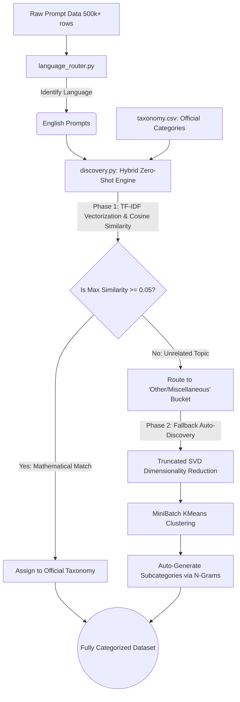

# Enterprise Zero-Shot Prompt Categorizer

**Developer:** Achut Mahadev Kadam (krishna0124@gmail.com)

An ultra-secure, highly scalable, and mathematically deterministic pipeline for categorizing hundreds of thousands (or millions) of user prompts without relying on external Deep Learning models, LLMs, or expensive cloud GPUs.

## 🔒 The Enterprise Security & Cost Advantage

In highly regulated enterprise environments, sending proprietary company data or customer prompts to external Large Language Models (like OpenAI, Anthropic, etc.) is an absolute non-starter due to strict data privacy and leakage concerns. 

Furthermore, running local open-source LLMs requires significant infrastructure investments (expensive GPUs), complex security scrutiny, and extremely high operational costs.

This repository completely bypasses those limitations by utilizing **pure mathematics and linear algebra (Zero-Shot NLP techniques)** to achieve highly reliable categorization:
- **Zero Data Leakage:** The entire pipeline runs 100% locally on standard CPUs. It can be run on an air-gapped machine. No data ever leaves the enterprise.
- **Zero API Costs:** No third-party API calls, eliminating usage fees entirely.
- **Zero GPU Requirements:** Operates efficiently on standard hardware using highly optimized `scikit-learn` algorithms.
- **Zero Hallucination:** Because categorization is based strictly on mathematical Cosine Similarity between vector angles, the system is 100% deterministic and cannot "guess" or "hallucinate" false responses.

## ⚙️ How it Works (The Math)

This pipeline achieves state-of-the-art zero-shot categorization by combining predefined enterprise taxonomies with a dynamic fallback clustering algorithm.

1. **TF-IDF Vectorization:** It strips English sentences of useless "stop words" and converts the core keywords (and 2-word N-Grams) of both the user prompts and the official enterprise taxonomies into high-dimensional mathematical vectors.
2. **Cosine Similarity Routing:** It calculates the literal geometric angle between a user's prompt vector and the taxonomy vectors. If a prompt mathematically overlaps with an official enterprise category, it is permanently locked into that category.
3. **K-Means Auto-Discovery (The Safety Net):** If a prompt discusses a topic completely unrelated to the official enterprise taxonomy (a near-zero similarity score), the pipeline rejects it and isolates it into a fallback bucket. It then uses Truncated SVD and MiniBatch K-Means clustering to geometrically group these unknown prompts and auto-generate new subcategories based on their most frequent N-Grams.

### 🧠 Beyond Simple Keywords: Near-Semantic Accuracy

It is important to understand that this is **not** a simple `CTRL+F` or binary keyword search (e.g., `IF "SQL" IN PROMPT THEN CATEGORY A`). 

It relies on **Term Frequency-Inverse Document Frequency (TF-IDF)** and **N-Grams** mapped into a 10,000-dimensional geometric space.
* **The Weighting System:** Common words are mathematically dampened, while highly unique, identifying words are amplified. 
* **The Example:** If your official taxonomy is *"SQL query logic troubleshooting"*, it exists as a specific coordinate in 10,000-dimensional space. If a user types *"I need help debugging the logic of my SQL select statement"*, the pipeline does not just look for the word "SQL". It calculates the weights of "logic", "SQL", and the N-Gram "SQL select", creating a secondary geometric point. 
* **The Result:** Cosine Similarity measures the physical angle between those two points. Even if the user doesn't say "troubleshooting", the multidimensional angle is tight enough to register a highly accurate, near-semantic match.

## ⚠️ Known Limitations

While this architecture is incredibly fast, cheap, and secure, relying on Linear Algebra instead of a neural network introduces a few strict limitations:

1. **Vocabulary Rigidity (No True Context):** Because it does not use a Transformer (LLM), it does not actually "understand" language. If a user uses completely different vocabulary to describe the same concept (e.g., saying *"My database grabber is broken"* instead of *"SQL query error"*), the math will fail to find a similarity because it does not know that "database grabber" means "SQL". 
2. **Dimension Dilution (Short Prompts Required):** This engine strictly truncates all prompts to a maximum of 50 words. In geometric TF-IDF space, if a user pastes a 5,000-word essay, their vector gets diluted across thousands of dimensions, destroying the Cosine Similarity angle and making it impossible to match against a short 5-word taxonomy description.
3. **The "Other" Bucket Ambiguity:** The fallback KMeans algorithm strictly groups things mathematically. It may sometimes create subcategories that look like *"error_failed"* because those two words appeared frequently together, requiring slight human oversight to understand what the auto-generated cluster actually represents.

## 📊 Pipeline Flowchart



## 🚀 Quickstart

### 1. Prepare your Data
Place your raw text prompts (e.g., `prompt_sample.txt`) in the `data/` directory.
Ensure your official enterprise categories are defined in `data/taxonomy.csv`.

### 2. Filter Languages
```bash
python src/language_router.py
```
This isolates English prompts into `english_prompts.txt` and logs its progress dynamically.

### 3. Run the Categorizer
```bash
python src/discovery.py
```
This will mathematically map all prompts against the taxonomies. It outputs:
- `fully_categorized_dataset.csv`: Your millions of prompts securely assigned to categories.
- `hybrid_taxonomy_mapping.csv`: Your official enterprise taxonomies + any auto-discovered fallback subcategories.
